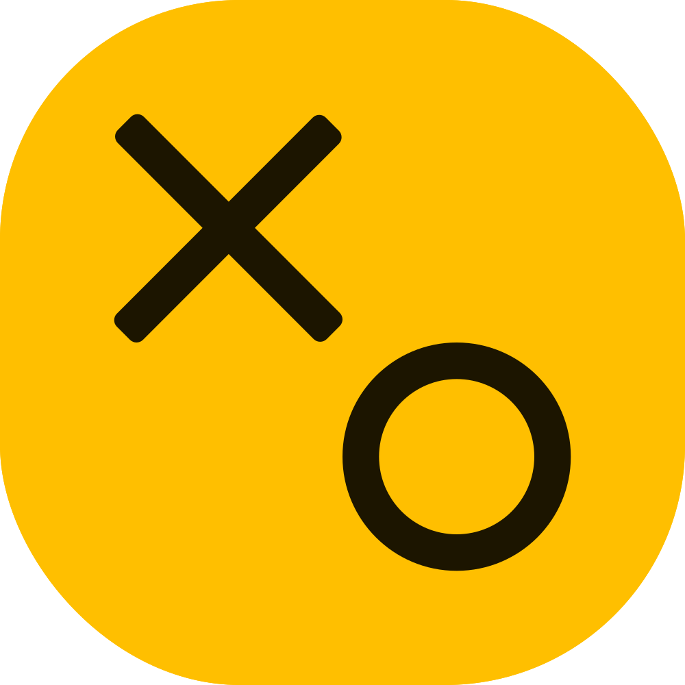
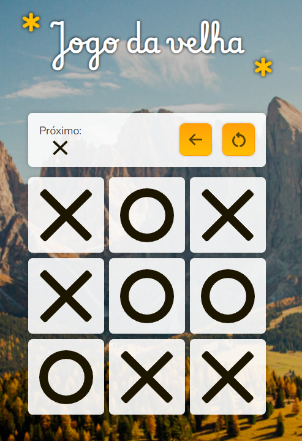

<p align="center">
  
</p>

<h1 align="center">Jogo da Velha Impossível</h1>

<br>

O projeto se trata de um Jogo da Velha comum, que implementa uma **IA invencível**, onde o máximo que o jogador conseguira é um empate, o objetivo final é conseguir desenvolver um algoritmo capaz de ser imbatível e, em simultâneo, criar uma UI bonita e responsiva.

Para testar o projeto utilize este comando para baixar as dependências:

```console
npm install
```

Assim que terminar, execute este para subir o projeto em um servidor HTTP de testes através do Vite (a URL aparece no próprio comando)

```console
npm run dev
```

<br>

### 🛠️ Tecnologias Utilizadas

- HTML
- CSS
- Javascript
- Typescript
- Vite + Plugins

<br>

_Acho importante citar que o termo "IA" se refere ao conceito "clássico" de IA, então não, não é um ChatGPT jogando contra você, na verdade, é um algoritmo de poucas linhas — mas ainda muito eficiente._

<br>
<p align="center">
  
</p>
<br>

## ❌ Jogo da Velha

Creio que seja improvável que você não saiba as regras do Jogo da Velha (fora do Brasil conhecido como Tictactoe), mas se esse é seu caso, irei resumir as regras:

- O "tabuleiro" do jogo são 9 campos dispostos em uma grade de 3x3
- Existem dois símbolos que irão preencher essa grade, **X** e **O**
- O primeiro a jogar geralmente é o **X**
- A cada rodada o jogador pode colocar apenas o seu símbolo em um campo vazio
- O jogador que preencher uma linha, coluna ou diagonal reta com o seu símbolo primeiro vence
- Caso todos os campos sejam preenchidos sem ninguém conseguir uma linha, o jogo acaba empatado

### Só Perde Se Quiser

Caso você saiba jogar, você só perderia por falta de atenção, isso acontece, pois, bom... Jogo da Velha está longe de ser complexo, você só tem 9 opções de jogadas no melhor caso, isso torna o jogo extremamente fácil de ser _dominado_ (imagina dizer para alguém que você é profissional de Jogo da Velha), caso enfrente outro adversário que também saiba jogar, sempre acabara empatado. Curiosidade: o Xadrez também possui uma forma de jamais perder (O único problema é que existem cerca de 10<sup>120</sup> combinações possíveis 🤯)

## 🤖 A IA

A IA informa para o jogo o campo onde deseja jogar, ela alterna entre 3 tipos jogadas conforme a disposição dos símbolos do adversário e a rodada atual:

```js
private AIMove(): Pos {
  const aiCriticalMove = this.AICriticalMove();
  if (aiCriticalMove !== null) return aiCriticalMove;
  if (this.moves < 5) {
    const aiStrategicMove = this.AIStrategicMove();
    if (
      aiStrategicMove !== null &&
      this.fields[aiStrategicMove] === Symb.EMPTY
    )
    return aiStrategicMove;
  }
  return this.AIRandomPossibleMove(null);
}
```

- **1º Etapa - Jogada crítica:** Verifica primeiro se existe alguma forma imediata de vencer (uma linha que falte apenas um símbolo), caso encontre, retorna o campo que falta e vence o jogo, caso contrário, verifica se o jogador possui alguma forma imediata de vencer, caso encontre, retorna o campo que evita a derrota.
- **2º Etapa - Jogada estratégica:** Caso não tenha encontrado nenhuma jogada crítica, o algoritmo utiliza uma estrutura de dados que mapeia jogadas diferentes conforme os campos onde o usuário jogou, o objetivo é tentar encurralar o jogador e, ao mesmo tempo, evitar ser encurralado, a estrutura possui esses mapeamentos até a 5º jogada, após isso, essa abordagem se torna inútil.
- **3º Etapa - Jogada aleatória:** Caso não haja nenhuma jogada crítica nem estratégica, o algoritmo simplesmente joga em algum campo que esteja disponível de forma pseudoaleatória (`Math.random()`).

### Estrutura de dados

```js
[
  [
    // 1º Movimento (IA começou)
    { response: start },
  ],
  [
    // 2º Movimento (Jogador começou)
    { all: Pos.CT_MD, response: start },
    { response: Pos.CT_MD },
  ],
  [
    // 3º Movimento (IA começou)
    { all: Pos.CT_MD, response: inverse },
    { atLeast: line, response: column[1] },
    { atLeast: column, response: line[1] },
    { response: [column[1], line[1]] },
  ],
  [
    // 4º Movimento (Jogador começou)
    { all: [Pos.TP_LE, Pos.BT_RI], response: CARDINALS },
    { all: [Pos.TP_RI, Pos.BT_LE], response: CARDINALS },
    { all: Pos.CT_MD, atLeast: CORNERS, response: [column[1], line[1]] },
    { all: Pos.TP_MD, atLeast: [Pos.CT_LE, Pos.CT_RI], response: [Pos.TP_LE, Pos.TP_RI] },
    { all: Pos.BT_MD, atLeast: [Pos.CT_LE, Pos.CT_RI], response: [Pos.BT_LE, Pos.BT_RI] },
    { all: Pos.TP_MD, atLeast: [Pos.BT_LE, Pos.BT_RI], response: Pos.TP_LE },
    { all: Pos.BT_MD, atLeast: [Pos.TP_LE, Pos.TP_RI], response: Pos.BT_LE },
    { all: Pos.CT_LE, atLeast: [Pos.TP_RI, Pos.BT_RI], response: Pos.BT_LE },
    { all: Pos.CT_RI, atLeast: [Pos.TP_LE, Pos.BT_LE], response: Pos.BT_RI },
  ],
  [
    // 5º Movimento (IA começou)
    { all: [Pos.TP_MD, Pos.CT_LE], response: Pos.CT_MD },
    { all: [Pos.TP_MD, Pos.CT_RI], response: Pos.CT_MD },
    { all: [Pos.BT_MD, Pos.CT_LE], response: Pos.CT_MD },
    { all: [Pos.BT_MD, Pos.CT_RI], response: Pos.CT_MD },
    { all: [line[0], column[0]], response: inverse },
    { response: [line[1], column[1], inverse] },
  ],
];
```

Este é o núcleo da aplicação, uma tabela de resposta condicional, cada item desse array corresponde a uma rodada, e cada item se trata de outro array com objetos do tipo `AIConditionalMove`, que são onde a brincadeira acontece, dentro deles temos basicamente duas condições e uma jogada para "responder" à aquelas condições, veja o que representa cada propriedade:

- **`all`:** As posições a serem verificadas, a função que faz a leitura interpreta como um operador AND, ou seja, todas as posições devem conter o símbolo do jogador para a condição ser verdadeira.
- **`atLeast`:** As posições a serem verificadas, a função que faz a leitura interpreta como um operador OR, ou seja, se uma ou mais posições conter o símbolo do jogador, a condição é verdadeira.
- **`response`:** A jogada certa caso ambas as condições de `all` e `atLeast` sejam satisfeitas.

Está é a função que faz a leitura dessas condições:

```js
private AICheckCondition(aiCondition: AIConditionalMove): Pos | Pos[] | null {
  let { all, atLeast, response } = aiCondition;
  if (all !== undefined) {
    all = Array.isArray(all) ? all : [all];
    for (const pos of all) {
      if (this.fields[pos] !== this.playerSymbol) {
        return null;
      }
    }
  }
  let atLeastTest = true;
  if (atLeast !== undefined) {
    atLeast = Array.isArray(atLeast) ? atLeast : [atLeast];
    atLeastTest = false;
    for (const pos of atLeast) {
      if (this.fields[pos] === this.playerSymbol) {
        atLeastTest = true;
        break;
      }
    }
  }
  return atLeastTest ? response : null;
}
```
